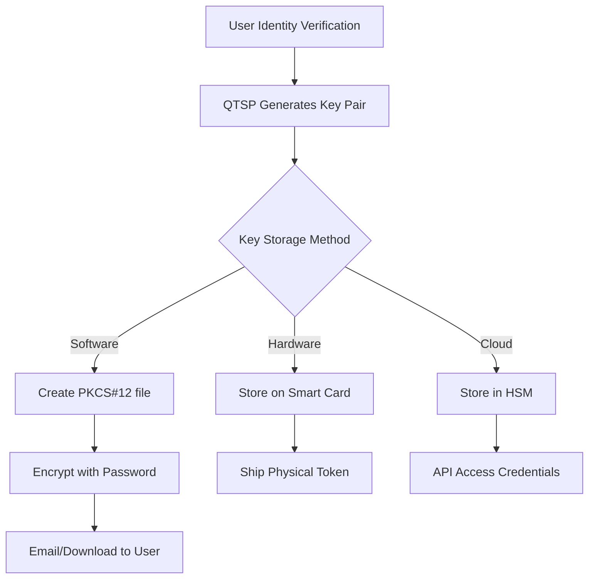

# QES Private Key File to Valid Signature - Complete Process

## 1. Private Key File Formats

### PKCS#12 / PFX Files
These are the most common formats for distributing QES certificates with private keys.

```
Structure of .p12/.pfx file:
├── Private Key (encrypted with password)
├── Certificate (user's QES certificate)
├── Certificate Chain (intermediate CAs)
└── Optional: Root CA certificate

File Extensions:
- .p12 (PKCS#12)
- .pfx (Microsoft's name for PKCS#12)
- .cer/.crt (certificate only, no private key)
```

### How QTSPs Issue These Files



## 2. Detailed Process: Private Key to QES Signature

### Step 1: Loading the Private Key

```javascript
// Example using Node.js forge library
const forge = require('node-forge');

// Load PKCS#12 file
const p12Der = fs.readFileSync('user_qes_certificate.p12', 'binary');
const p12Asn1 = forge.asn1.fromDer(p12Der);

// Decrypt with password
const p12 = forge.pkcs12.pkcs12FromAsn1(p12Asn1, 'user_password');

// Extract private key and certificate
const bags = p12.getBags({bagType: forge.pki.oids.pkcs8ShroudedKeyBag});
const privateKey = bags[forge.pki.oids.pkcs8ShroudedKeyBag][0].key;

const certBags = p12.getBags({bagType: forge.pki.oids.certBag});
const certificate = certBags[forge.pki.oids.certBag][0].cert;
```

### Step 2: Preparing the PDF for Signing

```
PDF Structure Before Signing:
├── Document Content
├── Metadata
└── (No signatures yet)

PDF Structure After PAdES Preparation:
├── Document Content
├── Signature Dictionary (placeholder)
│   ├── /ByteRange [0 840 960 1200]  # Defines what to sign
│   ├── /Contents <0000...0000>       # Placeholder for signature
│   └── /Filter /Adobe.PPKLite
└── Space for signature (padded)
```

### Step 3: Computing Document Hash

```javascript
// PAdES signing process
function preparePDFForSigning(pdfBuffer) {
    // 1. Add signature dictionary with placeholder
    const signatureDict = {
        Type: 'Sig',
        Filter: 'Adobe.PPKLite',
        SubFilter: 'adbe.pkcs7.detached',
        ByteRange: [0, 0, 0, 0],  // Will be updated
        Contents: new Array(8192).fill(0),  // Placeholder
        Reason: 'Contract Agreement',
        Location: 'Brussels, Belgium',
        ContactInfo: 'user@example.com'
    };

    // 2. Calculate ByteRange (everything except signature)
    // ByteRange: [0, start_of_sig, end_of_sig, end_of_file]
    const byteRange = calculateByteRange(pdfWithDict);

    // 3. Extract bytes to be signed
    const bytesToSign = Buffer.concat([
        pdfBuffer.slice(byteRange[0], byteRange[1]),
        pdfBuffer.slice(byteRange[2], byteRange[3])
    ]);

    // 4. Hash the bytes
    const documentHash = crypto
        .createHash('sha256')
        .update(bytesToSign)
        .digest();

    return { documentHash, byteRange, pdfWithPlaceholder };
}
```

### Step 4: Creating the CMS/PKCS#7 Signature

```javascript
// This is where the actual cryptographic signing happens
function createCMSSignature(documentHash, privateKey, certificate, chain) {
    // 1. Create SignedData structure
    const p7 = forge.pkcs7.createSignedData();

    // 2. Add content (detached - not included in signature)
    p7.content = forge.util.createBuffer(documentHash);

    // 3. Add signer certificate
    p7.addCertificate(certificate);

    // 4. Add certificate chain
    chain.forEach(cert => p7.addCertificate(cert));

    // 5. Add signer information
    p7.addSigner({
        key: privateKey,
        certificate: certificate,
        digestAlgorithm: forge.pki.oids.sha256,
        authenticatedAttributes: [
            {
                type: forge.pki.oids.contentType,
                value: forge.pki.oids.data
            },
            {
                type: forge.pki.oids.messageDigest,
                value: documentHash  // This binds signature to document
            },
            {
                type: forge.pki.oids.signingTime,
                value: new Date()
            }
        ]
    });

    // 6. Sign (this uses the private key!)
    p7.sign({detached: true});

    // 7. Convert to DER format
    const asn1 = p7.toAsn1();
    const der = forge.asn1.toDer(asn1);

    return der.getBytes();
}
```

### Step 5: The Actual ECDSA Signing (Inside PKCS#7)

```javascript
// What happens inside p7.sign() for ECDSA P-256
function ecdsaSign(privateKey, dataToSign) {
    // 1. Hash the authenticated attributes
    const hash = crypto.createHash('sha256')
        .update(authenticatedAttributesDER)
        .digest();

    // 2. ECDSA signing operation
    const EC = require('elliptic').ec;
    const ec = new EC('p256');

    // Private key is a scalar (d)
    const keyPair = ec.keyFromPrivate(privateKey, 'hex');

    // Generate signature (r, s)
    const signature = keyPair.sign(hash);

    // 3. Encode as DER
    return {
        r: signature.r.toString('hex'),
        s: signature.s.toString('hex')
    };
}
```

### Step 6: Adding Timestamp (PAdES-T)

```javascript
// Request timestamp from TSA (Time Stamping Authority)
async function addTimestamp(signature) {
    // 1. Create timestamp request
    const tsReq = {
        version: 1,
        messageImprint: {
            hashAlgorithm: 'sha256',
            hashedMessage: sha256(signature)
        },
        certReq: true,
        nonce: crypto.randomBytes(8)
    };

    // 2. Send to TSA (e.g., FreeTSA, DigiCert TSA)
    const response = await fetch('https://freetsa.org/tsr', {
        method: 'POST',
        headers: {'Content-Type': 'application/timestamp-query'},
        body: createTSRequest(tsReq)
    });

    // 3. Parse timestamp response
    const tsToken = await response.buffer();

    // 4. Embed in signature (creates PAdES-T)
    return embedTimestampInSignature(signature, tsToken);
}
```

### Step 7: Embedding Signature in PDF

```javascript
function embedSignatureInPDF(pdfWithPlaceholder, cmsSignature, byteRange) {
    // 1. Convert CMS signature to hex
    const signatureHex = Buffer.from(cmsSignature).toString('hex');

    // 2. Pad to fit in reserved space
    const paddedSignature = signatureHex.padEnd(8190, '0');

    // 3. Replace placeholder with actual signature
    const finalPDF = Buffer.from(pdfWithPlaceholder);
    finalPDF.write('<' + paddedSignature + '>', byteRange[1], 'ascii');

    return finalPDF;
}
```

## 3. Complete Example: Software-Based QES Signing

```javascript
async function signPDFWithQES(pdfPath, p12Path, password) {
    // 1. Load private key and certificate from PKCS#12
    const p12 = loadPKCS12(p12Path, password);
    const privateKey = p12.privateKey;
    const certificate = p12.certificate;
    const chain = p12.chain;

    // 2. Verify certificate is qualified
    if (!isQualifiedCertificate(certificate)) {
        throw new Error('Certificate is not qualified');
    }

    // 3. Prepare PDF with signature placeholder
    const pdf = fs.readFileSync(pdfPath);
    const { documentHash, byteRange, pdfWithPlaceholder } =
        preparePDFForSigning(pdf);

    // 4. Create CMS signature structure
    const cmsSignature = createCMSSignature(
        documentHash,
        privateKey,
        certificate,
        chain
    );

    // 5. Add timestamp (for PAdES-T)
    const timestampedSignature = await addTimestamp(cmsSignature);

    // 6. Embed signature in PDF
    const signedPDF = embedSignatureInPDF(
        pdfWithPlaceholder,
        timestampedSignature,
        byteRange
    );

    // 7. Save signed PDF
    fs.writeFileSync('signed_' + pdfPath, signedPDF);

    return signedPDF;
}
```

## 4. What Our ZK System Extracts

After the above process, our system extracts:

```javascript
function extractForZKProof(signedPDF) {
    // 1. Parse PDF to get signature
    const signatureDict = parsePDFSignature(signedPDF);
    const cmsData = signatureDict.Contents;

    // 2. Parse CMS/PKCS#7 structure
    const p7 = forge.pkcs7.messageFromAsn1(
        forge.asn1.fromDer(cmsData)
    );

    // 3. Extract ECDSA signature (r, s)
    const signerInfo = p7.signerInfos[0];
    const signature = parseECDSASignature(signerInfo.signature);

    // 4. Extract public key from certificate
    const cert = p7.certificates[0];
    const publicKey = cert.publicKey;

    // 5. Compute document hash from ByteRange
    const byteRange = signatureDict.ByteRange;
    const documentBytes = extractByteRange(signedPDF, byteRange);
    const documentHash = sha256(documentBytes);

    return {
        signature: {
            r: signature.r,
            s: signature.s
        },
        publicKey: {
            x: publicKey.x,
            y: publicKey.y
        },
        documentHash: documentHash,
        certificate: cert.raw  // For trust list verification
    };
}
```

## 5. Security Considerations

### Private Key Protection

```
Software Certificates (PKCS#12):
├── Risk: Key can be extracted if password compromised
├── Protection: Strong password + secure storage
└── Usage: Lower-security applications

Hardware Tokens (Smart Cards):
├── Risk: Physical theft (but PIN protected)
├── Protection: Key never leaves hardware
└── Usage: High-security QES

Cloud HSM:
├── Risk: Account compromise
├── Protection: 2FA + API restrictions
└── Usage: High-volume signing
```

### Certificate Validation Requirements

```javascript
function isQualifiedCertificate(cert) {
    // 1. Check QCP (Qualified Certificate Policy) OID
    const policyOIDs = cert.extensions.certificatePolicies;
    const QCP_OIDs = [
        '0.4.0.194112.1.2',  // QCP-n-qscd (eIDAS)
        '0.4.0.194112.1.4',  // QCP-l-qscd (eIDAS)
    ];

    if (!policyOIDs.some(oid => QCP_OIDs.includes(oid))) {
        return false;
    }

    // 2. Verify issuer is a QTSP
    const issuer = cert.issuer;
    if (!isInEUTrustList(issuer)) {
        return false;
    }

    // 3. Check certificate validity
    const now = new Date();
    if (now < cert.notBefore || now > cert.notAfter) {
        return false;
    }

    // 4. Verify certificate chain to trusted root
    return verifyCertificateChain(cert);
}
```

## 6. Common QES Software/Libraries

### Commercial Solutions
- Adobe Acrobat (built-in QES support)
- DocuSign (QES via partnership with QTSPs)
- SignDoc (Kofax)
- DigiSigner
- Ascertia

### Open Source Libraries
- PDFBox (Java) - Basic signing
- iText (Java/.NET) - Advanced PAdES
- HexaPDF (Ruby) - PAdES support
- PyHanko (Python) - PAdES signing
- PDFSign.js (JavaScript) - Browser-based

### Command Line Tools
```bash
# Using OpenSSL and pdfsig
# 1. Extract private key from PKCS#12
openssl pkcs12 -in cert.p12 -out key.pem -nocerts -nodes

# 2. Extract certificate
openssl pkcs12 -in cert.p12 -out cert.pem -nokeys

# 3. Sign with pdfsig (Linux)
pdfsig -sign 1 -nick "John Doe" -password "pass" document.pdf signed.pdf
```

## 7. The Gap Our ZK System Fills

### Current QES Process:
1. ✅ Legal validity
2. ❌ No privacy (signature reveals identity)
3. ❌ No blockchain audit trail
4. ❌ Cross-border verification complex

### With Our ZK Layer:
1. ✅ Legal validity (preserved)
2. ✅ Privacy (signature hidden in ZK proof)
3. ✅ Blockchain audit trail (Aztec)
4. ✅ Universal verification (one system)

## Summary

The journey from private key file to QES signature involves:

1. **Key Storage**: PKCS#12 file with password protection
2. **PDF Preparation**: Adding signature dictionary with ByteRange
3. **Hash Calculation**: SHA-256 of document bytes (excluding signature area)
4. **CMS Creation**: Building PKCS#7 structure with authenticated attributes
5. **ECDSA Signing**: Using private key to sign the authenticated attributes
6. **Timestamping**: Adding TSA token for PAdES-T
7. **Embedding**: Placing final signature in PDF

Our ZK system takes the OUTPUT of this process (signed PDF) and creates privacy-preserving proofs about it, without ever needing access to the private key.