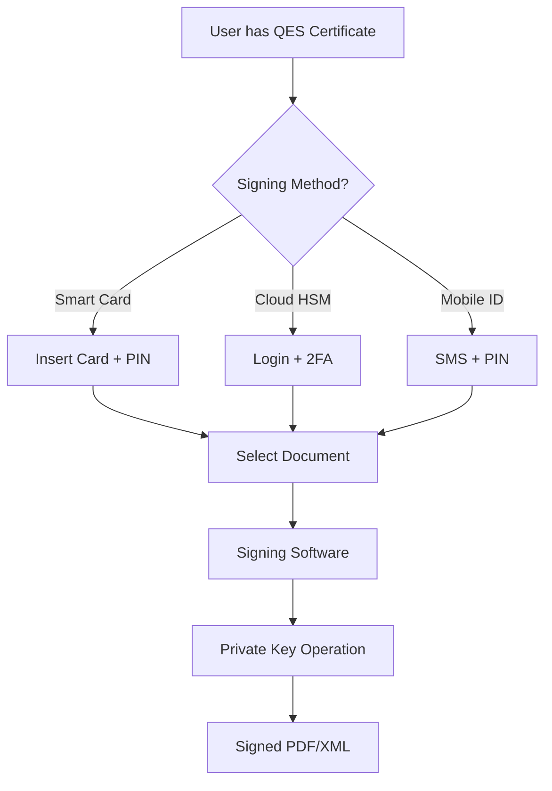

# QES (Qualified Electronic Signature) - How It Actually Works

## 1. What QES Issuers Actually Provide

### The QES Certificate Issuance Process

**What you get from a Qualified Trust Service Provider (QTSP):**

1. **Qualified Certificate** (X.509 v3)
   - Stored on: Smart card, USB token, or cloud HSM
   - Format: Usually PKCS#12 (.p12) or on hardware
   - Contains: Your public key + identity attributes
   - Private key: NEVER leaves the secure device

2. **Signing Methods:**

### Method A: Smart Card / USB Token (Most Common)
```
Physical Device Contains:
├── Private Key (non-extractable)
├── Certificate (public)
├── PKCS#11 interface
└── PIN protection

User Process:
1. Insert smart card
2. Install middleware (e.g., SafeNet, Gemalto)
3. Enter PIN
4. Sign document using:
   - Adobe Acrobat
   - DocuSign with QES
   - Local signing software
```

### Method B: Remote Signing (Cloud HSM)
```
Cloud-Based QES (e.g., Swisscom, D-Trust):
├── Private key in HSM (never exported)
├── API access
├── 2FA authentication
└── Sign via:
    - Web portal
    - API integration
    - Mobile app with biometrics
```

### Method C: Mobile ID (SIM-based)
```
Mobile Network Operator Issues:
├── SIM card with crypto chip
├── Private key on SIM
├── SMS + PIN authentication
└── Limited to specific countries
```

## 2. The Actual Signing Workflow

### Traditional QES Signing Process:



### What Actually Happens:

1. **User CANNOT export private key**
   - Smart card: Physically impossible
   - Cloud HSM: API only, no key access
   - Mobile ID: SIM-locked

2. **Signing requires:**
   - Physical possession (smart card) OR
   - Authentication (cloud) OR
   - Phone control (mobile ID)

3. **Output:**
   - Signed document (PDF, XML, etc.)
   - Signature contains certificate
   - Timestamp from TSA

## 3. The Problem for Our ZK Solution

### ❌ CRITICAL ISSUE: We Can't Access Private Keys

**Current Assumption in Our System:**
```javascript
// Our current workflow assumes:
const signature = extractSignature(signed_pdf);  // ✅ This works
const privateKey = getUserPrivateKey();          // ❌ IMPOSSIBLE!

// Generate ZK proof
const proof = generateProof({
    signature,        // We have this
    privateKey,       // We DON'T have this!
    document
});
```

**Reality:**
- User signs with smart card → We get signed PDF
- We can extract signature from PDF ✅
- We CANNOT get private key to re-sign ❌
- We CANNOT create new signatures ❌

### 🤔 What We Actually CAN Do:

**Option 1: Proof of Existing Signature**
```javascript
// User provides already-signed document
const signedPDF = getUserSignedDocument();
const signature = extractSignature(signedPDF);
const certificate = extractCertificate(signedPDF);

// Prove signature is valid WITHOUT private key
const proof = proveSignatureValidity({
    signature,      // (r, s) values
    publicKey,      // From certificate
    documentHash,   // From PDF
    // NO PRIVATE KEY NEEDED for verification!
});
```

**Option 2: Delegated Signing (Requires Infrastructure)**
```
1. Partner with QTSP
2. User authorizes our system
3. QTSP signs on user's behalf via API
4. We generate ZK proof of that signature
```

## 4. Real QES Providers and Their APIs

### Major EU QTSPs:

**1. Swisscom (Switzerland)**
- Remote signing API
- User keeps key in their HSM
- OAuth2 authentication
- Can't export keys

**2. D-Trust (Germany)**
- Smart card + remote signing
- SOAP/REST API
- Requires user consent per signature
- No key access

**3. Luxtrust (Luxembourg)**
- Mobile app + smart card
- API for remote signing
- Strict authentication
- Keys never leave HSM

**4. DocuSign QES (Multiple countries)**
- Partners with local QTSPs
- Cloud-based signing
- API available
- But still no key export

## 5. The Fundamental Realization

### Our System Needs to Work Differently:

**❌ What We CAN'T Do:**
- Get user's private key
- Create new signatures
- Sign on user's behalf (without QTSP partnership)

**✅ What We CAN Do:**
- Verify existing signatures
- Prove signature validity in ZK
- Create proofs about already-signed documents
- Store proofs on Aztec

### Revised Workflow:

```
1. User signs document with their QES (smart card/cloud)
   └── Creates signed PDF with embedded signature

2. User uploads signed PDF to our system
   └── We extract signature and certificate

3. We generate ZK proof that:
   - Signature is valid
   - Signer is in trust list
   - Document hash matches
   └── WITHOUT needing private key

4. Anchor proof on Aztec
   └── Privacy-preserving verification record
```

## 6. Implications for Our Solution

### Major Architecture Change Needed:

**From:** "We help users sign documents"
**To:** "We verify and prove existing QES signatures"

### This Actually Makes More Sense:

1. **Legal:** User signs with their official QES
2. **Technical:** We prove signature validity
3. **Privacy:** ZK hides signature details
4. **Blockchain:** Immutable verification record

### Use Cases That Still Work:

✅ **Multi-party contract verification**
- Each party signs with their QES
- We prove all signatures valid
- Anchor proofs on Aztec

✅ **Privacy-preserving audit trail**
- Documents signed normally
- ZK proofs verify without revealing
- Compliant and private

✅ **Cross-border validation**
- EU company signs with eIDAS
- US company signs with DocuSign QES
- Both proofs on Aztec

## 7. What Changes in Our Implementation

### No Changes Needed:
- ✅ Signature extraction from PDF
- ✅ Certificate validation
- ✅ Trust list checking
- ✅ ZK proof generation
- ✅ Aztec anchoring

### Messaging Changes:
- ❌ "ZK signing solution"
- ✅ "ZK signature verification"
- ✅ "Privacy-preserving proof of existing QES"
- ✅ "Blockchain-anchored signature validation"

## 8. QES File Formats We Handle

### Input: What QTSPs Produce
```
Signed Documents:
├── PAdES (PDF) - Most common
│   ├── Embedded signature
│   ├── Certificate chain
│   └── Timestamp
├── XAdES (XML) - Government/B2B
│   ├── Detached or enveloped
│   └── Certificate reference
└── CAdES (CMS) - Email/Binary
    └── PKCS#7 structure
```

### What We Extract:
```javascript
// From any signed document:
{
  signature: {
    r: "0x...",  // ECDSA r value
    s: "0x...",  // ECDSA s value
  },
  certificate: {
    publicKey: { x, y },
    issuer: "CN=SwissSign Gold CA",
    subject: "CN=John Doe",
    serialNumber: "...",
    fingerprint: "SHA256:..."
  },
  documentHash: "0x...",
  timestamp: "2024-01-01T10:00:00Z"
}
```

## Conclusion: We're a Verification Layer, Not a Signing Service

Our value proposition should be:

**"Turn your existing QES signatures into privacy-preserving blockchain proofs"**

NOT:

**"Sign documents with zero-knowledge proofs"**

This is actually BETTER because:
1. Works with existing QES infrastructure
2. No regulatory issues (not issuing signatures)
3. Clear value add (privacy + blockchain)
4. Technically feasible today